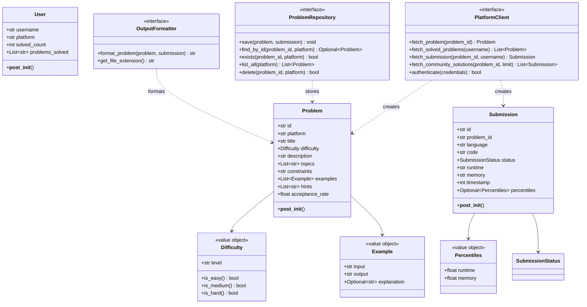
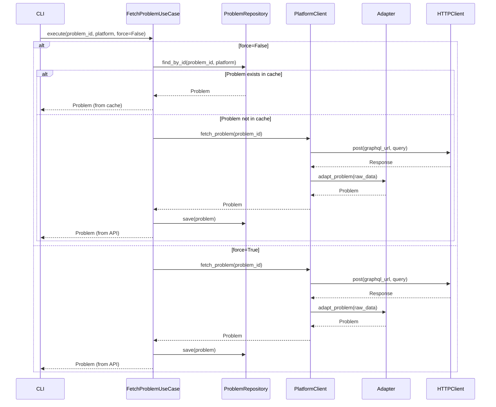
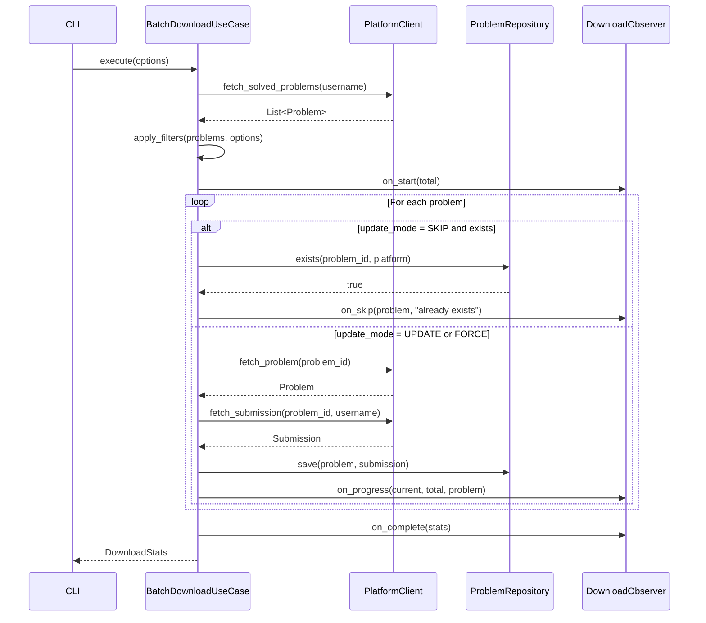
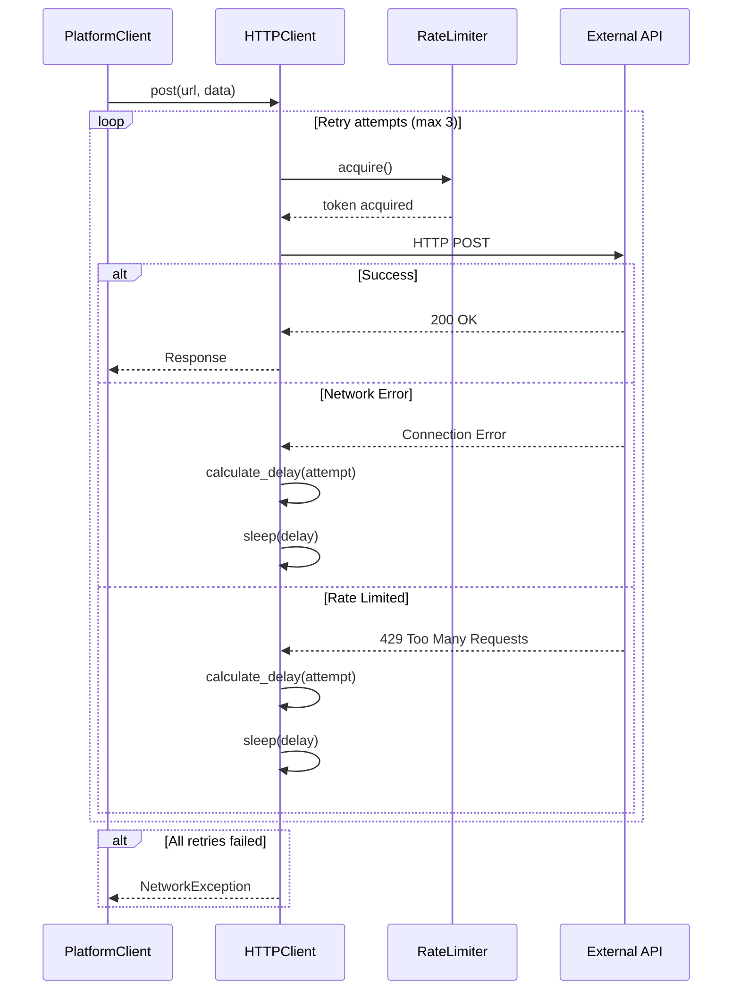

# Design Document: Coding Platform Crawler Refactor

## Overview

This design document outlines the refactoring of the existing LeetCode crawler into a well-architected, extensible system that supports multiple coding platforms (LeetCode, HackerRank, CodeChef, Codeforces) while following SOLID principles and implementing appropriate design patterns.

### Design Goals

1. **Maintainability**: Create a codebase that is easy to understand, modify, and extend
2. **Extensibility**: Support adding new platforms without modifying existing code
3. **Testability**: Achieve >80% test coverage with comprehensive unit, integration, and E2E tests
4. **Performance**: Maintain or improve current performance characteristics
5. **Reliability**: Implement robust error handling and retry mechanisms

### Key Design Decisions

- **Layered Architecture**: Separate concerns into CLI, Application, Domain, and Infrastructure layers
- **Strategy Pattern**: Abstract platform-specific implementations behind common interfaces
- **Dependency Injection**: Enable testability and flexibility through constructor injection
- **Repository Pattern**: Abstract data persistence to support multiple storage backends
- **Observer Pattern**: Decouple progress reporting from business logic

---

## Architecture

### High-Level Architecture

The system follows a layered architecture with clear separation of concerns:

```
┌─────────────────────────────────────────────────────────────┐
│                     CLI Layer                               │
│  - Command handlers (download, batch, list)                 │
│  - Argument parsing and validation                          │
│  - Console output formatting                                │
│  - Progress display                                         │
└─────────────────────────────────────────────────────────────┘
                            ↓
┌─────────────────────────────────────────────────────────────┐
│                  Application Layer                          │
│  - Use cases (FetchProblem, BatchDownload, ListProblems)    │
│  - Business logic orchestration                             │
│  - Update strategies (skip, update, force)                  │
│  - Rate limiting service                                    │
└─────────────────────────────────────────────────────────────┘
                            ↓
┌─────────────────────────────────────────────────────────────┐
│                    Domain Layer                             │
│  - Entities (Problem, Submission, User)                     │
│  - Value objects (Difficulty, Percentiles)                  │
│  - Domain exceptions                                        │
│  - Business rules and validation                            │
└─────────────────────────────────────────────────────────────┘
                            ↓
┌─────────────────────────────────────────────────────────────┐
│                 Infrastructure Layer                        │
│  - Platform clients (LeetCode, HackerRank, etc.)            │
│  - HTTP client with retry logic                             │
│  - File system repository                                   │
│  - Output formatters (Python, JSON, Markdown)               │
└─────────────────────────────────────────────────────────────┘
```


### Layer Responsibilities

**CLI Layer**
- Parse command-line arguments
- Validate user input
- Display output to console
- Handle user interaction
- Coordinate with application layer

**Application Layer**
- Implement use cases (business workflows)
- Orchestrate domain and infrastructure components
- Manage transactions and error handling
- Apply business rules
- Coordinate observers for progress tracking

**Domain Layer**
- Define core business entities
- Enforce business rules and invariants
- Contain domain logic
- Define interfaces for external dependencies
- Remain independent of infrastructure concerns

**Infrastructure Layer**
- Implement platform-specific API clients
- Handle HTTP communication
- Manage file system operations
- Format output for different targets
- Implement retry and rate limiting logic

---

## Components and Interfaces

### Domain Layer Components

#### Core Entities

**Problem Entity**
```python
@dataclass
class Problem:
    """Represents a coding problem from any platform"""
    id: str
    platform: str
    title: str
    difficulty: Difficulty
    description: str
    topics: List[str]
    constraints: str
    examples: List[Example]
    hints: List[str]
    acceptance_rate: float
    
    def __post_init__(self):
        if not self.id:
            raise ValueError("Problem ID cannot be empty")
        if not self.title:
            raise ValueError("Problem title cannot be empty")
        if self.acceptance_rate < 0 or self.acceptance_rate > 100:
            raise ValueError("Acceptance rate must be between 0 and 100")
```

**Submission Entity**
```python
@dataclass
class Submission:
    """Represents a user's code submission"""
    id: str
    problem_id: str
    language: str
    code: str
    status: SubmissionStatus
    runtime: str
    memory: str
    timestamp: int
    percentiles: Optional[Percentiles] = None
    
    def __post_init__(self):
        if not self.code:
            raise ValueError("Submission code cannot be empty")
        if self.timestamp < 0:
            raise ValueError("Timestamp must be non-negative")
```


**User Entity**
```python
@dataclass
class User:
    """Represents a user profile on a coding platform"""
    username: str
    platform: str
    solved_count: int
    problems_solved: List[str]
    
    def __post_init__(self):
        if not self.username:
            raise ValueError("Username cannot be empty")
        if self.solved_count < 0:
            raise ValueError("Solved count must be non-negative")
        if len(self.problems_solved) != self.solved_count:
            raise ValueError("Problems solved list length must match solved count")
```

#### Value Objects

**Difficulty Value Object**
```python
@dataclass(frozen=True)
class Difficulty:
    """Immutable difficulty level"""
    level: str
    
    VALID_LEVELS = {"Easy", "Medium", "Hard"}
    
    def __post_init__(self):
        if self.level not in self.VALID_LEVELS:
            raise ValueError(f"Invalid difficulty: {self.level}. Must be one of {self.VALID_LEVELS}")
    
    def is_easy(self) -> bool:
        return self.level == "Easy"
    
    def is_medium(self) -> bool:
        return self.level == "Medium"
    
    def is_hard(self) -> bool:
        return self.level == "Hard"
```

**Example Value Object**
```python
@dataclass(frozen=True)
class Example:
    """Immutable problem example"""
    input: str
    output: str
    explanation: Optional[str] = None
    
    def __post_init__(self):
        if not self.input:
            raise ValueError("Example input cannot be empty")
        if not self.output:
            raise ValueError("Example output cannot be empty")
```

**Percentiles Value Object**
```python
@dataclass(frozen=True)
class Percentiles:
    """Immutable performance percentiles"""
    runtime: float
    memory: float
    
    def __post_init__(self):
        if not (0 <= self.runtime <= 100):
            raise ValueError("Runtime percentile must be between 0 and 100")
        if not (0 <= self.memory <= 100):
            raise ValueError("Memory percentile must be between 0 and 100")
```

#### Enumerations

```python
class SubmissionStatus(Enum):
    """Submission status enumeration"""
    ACCEPTED = "Accepted"
    WRONG_ANSWER = "Wrong Answer"
    TIME_LIMIT_EXCEEDED = "Time Limit Exceeded"
    MEMORY_LIMIT_EXCEEDED = "Memory Limit Exceeded"
    RUNTIME_ERROR = "Runtime Error"
    COMPILE_ERROR = "Compile Error"

class UpdateMode(Enum):
    """Update mode for batch downloads"""
    SKIP = "skip"      # Skip existing files
    UPDATE = "update"  # Update if newer submission exists
    FORCE = "force"    # Always overwrite
```


### Application Layer Interfaces

#### PlatformClient Interface (Strategy Pattern)

```python
class PlatformClient(ABC):
    """Abstract interface for platform-specific API clients"""
    
    @abstractmethod
    def fetch_problem(self, problem_id: str) -> Problem:
        """Fetch a single problem by ID"""
        pass
    
    @abstractmethod
    def fetch_solved_problems(self, username: str) -> List[Problem]:
        """Fetch all problems solved by a user"""
        pass
    
    @abstractmethod
    def fetch_submission(self, problem_id: str, username: str) -> Submission:
        """Fetch the last accepted submission for a problem"""
        pass
    
    @abstractmethod
    def fetch_community_solutions(self, problem_id: str, limit: int = 10) -> List[Submission]:
        """Fetch community solutions for a problem"""
        pass
    
    @abstractmethod
    def authenticate(self, credentials: Dict[str, str]) -> bool:
        """Authenticate with the platform"""
        pass
```

#### ProblemRepository Interface (Repository Pattern)

```python
class ProblemRepository(ABC):
    """Abstract interface for problem persistence"""
    
    @abstractmethod
    def save(self, problem: Problem, submission: Optional[Submission] = None) -> None:
        """Save a problem and optionally its submission"""
        pass
    
    @abstractmethod
    def find_by_id(self, problem_id: str, platform: str) -> Optional[Problem]:
        """Find a problem by ID and platform"""
        pass
    
    @abstractmethod
    def exists(self, problem_id: str, platform: str) -> bool:
        """Check if a problem exists in the repository"""
        pass
    
    @abstractmethod
    def list_all(self, platform: Optional[str] = None) -> List[Problem]:
        """List all problems, optionally filtered by platform"""
        pass
    
    @abstractmethod
    def delete(self, problem_id: str, platform: str) -> bool:
        """Delete a problem from the repository"""
        pass
```

#### OutputFormatter Interface (Strategy Pattern)

```python
class OutputFormatter(ABC):
    """Abstract interface for output formatting"""
    
    @abstractmethod
    def format_problem(self, problem: Problem, submission: Optional[Submission] = None) -> str:
        """Format a problem and submission for output"""
        pass
    
    @abstractmethod
    def get_file_extension(self) -> str:
        """Get the file extension for this formatter"""
        pass
```

#### DownloadObserver Interface (Observer Pattern)

```python
class DownloadObserver(ABC):
    """Abstract interface for download progress observation"""
    
    @abstractmethod
    def on_start(self, total: int) -> None:
        """Called when download batch starts"""
        pass
    
    @abstractmethod
    def on_progress(self, current: int, total: int, problem: Problem) -> None:
        """Called when a problem is downloaded"""
        pass
    
    @abstractmethod
    def on_skip(self, problem: Problem, reason: str) -> None:
        """Called when a problem is skipped"""
        pass
    
    @abstractmethod
    def on_error(self, problem: Problem, error: Exception) -> None:
        """Called when an error occurs"""
        pass
    
    @abstractmethod
    def on_complete(self, stats: DownloadStats) -> None:
        """Called when download batch completes"""
        pass
```


### Application Layer Use Cases

#### FetchProblemUseCase

```python
class FetchProblemUseCase:
    """Use case for fetching a single problem"""
    
    def __init__(
        self,
        client: PlatformClient,
        repository: ProblemRepository,
        logger: Logger
    ):
        self.client = client
        self.repository = repository
        self.logger = logger
    
    def execute(self, problem_id: str, platform: str, force: bool = False) -> Problem:
        """
        Fetch a problem from the platform or cache
        
        Args:
            problem_id: The problem identifier
            platform: The platform name
            force: If True, bypass cache and fetch from platform
        
        Returns:
            The fetched Problem entity
        
        Raises:
            ProblemNotFoundException: If problem doesn't exist
            NetworkException: If network request fails
        """
        # Check cache first unless force is True
        if not force:
            cached = self.repository.find_by_id(problem_id, platform)
            if cached:
                self.logger.info(f"Found {problem_id} in cache")
                return cached
        
        # Fetch from platform
        self.logger.info(f"Fetching {problem_id} from {platform}")
        problem = self.client.fetch_problem(problem_id)
        
        # Save to repository
        self.repository.save(problem)
        
        return problem
```

#### BatchDownloadUseCase

```python
@dataclass
class BatchDownloadOptions:
    """Options for batch download operation"""
    username: str
    platform: str
    update_mode: UpdateMode
    include_community: bool
    difficulty_filter: Optional[List[str]] = None
    topic_filter: Optional[List[str]] = None

@dataclass
class DownloadStats:
    """Statistics for a download operation"""
    total: int
    downloaded: int
    skipped: int
    failed: int
    duration: float

class BatchDownloadUseCase:
    """Use case for batch downloading problems"""
    
    def __init__(
        self,
        client: PlatformClient,
        repository: ProblemRepository,
        formatter: OutputFormatter,
        observers: List[DownloadObserver],
        logger: Logger
    ):
        self.client = client
        self.repository = repository
        self.formatter = formatter
        self.observers = observers
        self.logger = logger
    
    def execute(self, options: BatchDownloadOptions) -> DownloadStats:
        """
        Download multiple problems based on options
        
        Args:
            options: Configuration for the batch download
        
        Returns:
            Statistics about the download operation
        """
        start_time = time.time()
        
        # Fetch list of solved problems
        problems = self.client.fetch_solved_problems(options.username)
        
        # Apply filters
        problems = self._apply_filters(problems, options)
        
        # Notify observers
        self._notify_start(len(problems))
        
        # Download each problem
        stats = DownloadStats(
            total=len(problems),
            downloaded=0,
            skipped=0,
            failed=0,
            duration=0
        )
        
        for i, problem in enumerate(problems):
            try:
                self._download_problem(problem, options, stats)
                self._notify_progress(i + 1, len(problems), problem)
            except Exception as e:
                stats.failed += 1
                self._notify_error(problem, e)
                self.logger.error(f"Failed to download {problem.id}: {e}")
        
        stats.duration = time.time() - start_time
        self._notify_complete(stats)
        
        return stats
```


#### ListProblemsUseCase

```python
@dataclass
class ListOptions:
    """Options for listing problems"""
    platform: Optional[str] = None
    difficulty: Optional[List[str]] = None
    topics: Optional[List[str]] = None
    sort_by: str = "id"
    reverse: bool = False

class ListProblemsUseCase:
    """Use case for listing problems"""
    
    def __init__(
        self,
        repository: ProblemRepository,
        logger: Logger
    ):
        self.repository = repository
        self.logger = logger
    
    def execute(self, options: ListOptions) -> List[Problem]:
        """
        List problems from repository with filtering and sorting
        
        Args:
            options: Configuration for listing
        
        Returns:
            List of problems matching criteria
        """
        # Fetch all problems
        problems = self.repository.list_all(options.platform)
        
        # Apply filters
        if options.difficulty:
            problems = [p for p in problems if p.difficulty.level in options.difficulty]
        
        if options.topics:
            problems = [p for p in problems if any(t in p.topics for t in options.topics)]
        
        # Sort
        problems = self._sort_problems(problems, options.sort_by, options.reverse)
        
        return problems
```

### Infrastructure Layer Components

#### LeetCodeClient Implementation

```python
class LeetCodeClient(PlatformClient):
    """LeetCode-specific API client"""
    
    def __init__(
        self,
        http_client: HTTPClient,
        adapter: LeetCodeAdapter,
        config: Config,
        logger: Logger
    ):
        self.http_client = http_client
        self.adapter = adapter
        self.config = config
        self.logger = logger
        self.session_token: Optional[str] = None
    
    def fetch_problem(self, problem_id: str) -> Problem:
        """Fetch problem from LeetCode GraphQL API"""
        query = """
        query getProblem($titleSlug: String!) {
            question(titleSlug: $titleSlug) {
                questionId
                title
                difficulty
                content
                topicTags { name }
                hints
                exampleTestcases
                constraints
                stats
            }
        }
        """
        
        variables = {"titleSlug": problem_id}
        response = self.http_client.post(
            url=self.config.leetcode_graphql_url,
            json={"query": query, "variables": variables},
            headers=self._get_headers()
        )
        
        # Adapt raw response to domain model
        return self.adapter.adapt_problem(response.json())
    
    def fetch_solved_problems(self, username: str) -> List[Problem]:
        """Fetch all solved problems for a user"""
        # Implementation details...
        pass
    
    def fetch_submission(self, problem_id: str, username: str) -> Submission:
        """Fetch last accepted submission"""
        # Implementation details...
        pass
```


#### LeetCodeAdapter (Adapter Pattern)

```python
class LeetCodeAdapter:
    """Adapts LeetCode API responses to domain models"""
    
    def adapt_problem(self, raw_data: Dict) -> Problem:
        """Convert LeetCode API response to Problem entity"""
        question = raw_data["data"]["question"]
        
        return Problem(
            id=question["titleSlug"],
            platform="leetcode",
            title=question["title"],
            difficulty=Difficulty(question["difficulty"]),
            description=self._parse_html(question["content"]),
            topics=[tag["name"] for tag in question["topicTags"]],
            constraints=question.get("constraints", ""),
            examples=self._parse_examples(question.get("exampleTestcases", "")),
            hints=question.get("hints", []),
            acceptance_rate=self._parse_acceptance_rate(question["stats"])
        )
    
    def adapt_submission(self, raw_data: Dict) -> Submission:
        """Convert LeetCode submission response to Submission entity"""
        # Implementation details...
        pass
    
    def _parse_html(self, html: str) -> str:
        """Parse HTML content to plain text"""
        # Use BeautifulSoup or similar
        pass
    
    def _parse_examples(self, examples_str: str) -> List[Example]:
        """Parse example test cases"""
        # Implementation details...
        pass
```

#### FileSystemRepository Implementation

```python
class FileSystemRepository(ProblemRepository):
    """File system-based problem repository"""
    
    def __init__(
        self,
        base_path: Path,
        formatter: OutputFormatter,
        logger: Logger
    ):
        self.base_path = base_path
        self.formatter = formatter
        self.logger = logger
    
    def save(self, problem: Problem, submission: Optional[Submission] = None) -> None:
        """Save problem to file system"""
        # Create directory structure: base_path/platform/problem_id/
        problem_dir = self.base_path / problem.platform / problem.id
        problem_dir.mkdir(parents=True, exist_ok=True)
        
        # Format and write file
        content = self.formatter.format_problem(problem, submission)
        file_path = problem_dir / f"solution.{self.formatter.get_file_extension()}"
        
        file_path.write_text(content, encoding="utf-8")
        self.logger.info(f"Saved {problem.id} to {file_path}")
    
    def find_by_id(self, problem_id: str, platform: str) -> Optional[Problem]:
        """Find problem by ID"""
        problem_dir = self.base_path / platform / problem_id
        if not problem_dir.exists():
            return None
        
        # Parse file and reconstruct Problem entity
        # This requires storing metadata (JSON sidecar file)
        metadata_file = problem_dir / "metadata.json"
        if metadata_file.exists():
            data = json.loads(metadata_file.read_text())
            return self._deserialize_problem(data)
        
        return None
    
    def exists(self, problem_id: str, platform: str) -> bool:
        """Check if problem exists"""
        problem_dir = self.base_path / platform / problem_id
        return problem_dir.exists()
    
    def list_all(self, platform: Optional[str] = None) -> List[Problem]:
        """List all problems"""
        problems = []
        
        if platform:
            platforms = [platform]
        else:
            platforms = [p.name for p in self.base_path.iterdir() if p.is_dir()]
        
        for plat in platforms:
            platform_dir = self.base_path / plat
            if not platform_dir.exists():
                continue
            
            for problem_dir in platform_dir.iterdir():
                if problem_dir.is_dir():
                    problem = self.find_by_id(problem_dir.name, plat)
                    if problem:
                        problems.append(problem)
        
        return problems
```


#### HTTPClient with Retry Logic

```python
@dataclass
class RetryConfig:
    """Configuration for retry behavior"""
    max_retries: int = 3
    initial_delay: float = 1.0
    max_delay: float = 60.0
    exponential_base: float = 2.0
    jitter: bool = True

class HTTPClient:
    """HTTP client with retry and rate limiting"""
    
    def __init__(
        self,
        retry_config: RetryConfig,
        rate_limiter: RateLimiter,
        logger: Logger
    ):
        self.retry_config = retry_config
        self.rate_limiter = rate_limiter
        self.logger = logger
        self.session = requests.Session()
    
    def post(self, url: str, **kwargs) -> requests.Response:
        """POST request with retry logic"""
        return self._request_with_retry("POST", url, **kwargs)
    
    def get(self, url: str, **kwargs) -> requests.Response:
        """GET request with retry logic"""
        return self._request_with_retry("GET", url, **kwargs)
    
    def _request_with_retry(self, method: str, url: str, **kwargs) -> requests.Response:
        """Execute request with exponential backoff retry"""
        last_exception = None
        
        for attempt in range(self.retry_config.max_retries):
            try:
                # Apply rate limiting
                self.rate_limiter.acquire()
                
                # Make request
                response = self.session.request(method, url, **kwargs)
                response.raise_for_status()
                return response
                
            except requests.exceptions.RequestException as e:
                last_exception = e
                self.logger.warning(f"Request failed (attempt {attempt + 1}): {e}")
                
                if attempt < self.retry_config.max_retries - 1:
                    delay = self._calculate_delay(attempt)
                    self.logger.info(f"Retrying in {delay:.2f} seconds...")
                    time.sleep(delay)
        
        raise NetworkException(f"Request failed after {self.retry_config.max_retries} attempts") from last_exception
    
    def _calculate_delay(self, attempt: int) -> float:
        """Calculate exponential backoff delay with jitter"""
        delay = min(
            self.retry_config.initial_delay * (self.retry_config.exponential_base ** attempt),
            self.retry_config.max_delay
        )
        
        if self.retry_config.jitter:
            delay *= (0.5 + random.random() * 0.5)
        
        return delay
```

#### RateLimiter

```python
class RateLimiter:
    """Token bucket rate limiter"""
    
    def __init__(self, requests_per_second: float):
        self.requests_per_second = requests_per_second
        self.tokens = requests_per_second
        self.last_update = time.time()
        self.lock = threading.Lock()
    
    def acquire(self) -> None:
        """Acquire a token, blocking if necessary"""
        with self.lock:
            now = time.time()
            elapsed = now - self.last_update
            
            # Refill tokens
            self.tokens = min(
                self.requests_per_second,
                self.tokens + elapsed * self.requests_per_second
            )
            self.last_update = now
            
            # Wait if no tokens available
            if self.tokens < 1:
                sleep_time = (1 - self.tokens) / self.requests_per_second
                time.sleep(sleep_time)
                self.tokens = 0
            else:
                self.tokens -= 1
```


#### Output Formatters

```python
class PythonFormatter(OutputFormatter):
    """Format problems as Python files with comments"""
    
    def format_problem(self, problem: Problem, submission: Optional[Submission] = None) -> str:
        """Format problem as Python file"""
        lines = [
            '"""',
            f"{problem.title}",
            f"Difficulty: {problem.difficulty.level}",
            f"Platform: {problem.platform}",
            f"Topics: {', '.join(problem.topics)}",
            "",
            "Description:",
            problem.description,
            "",
            "Constraints:",
            problem.constraints,
            '"""',
            ""
        ]
        
        # Add examples as comments
        for i, example in enumerate(problem.examples, 1):
            lines.extend([
                f"# Example {i}:",
                f"# Input: {example.input}",
                f"# Output: {example.output}",
            ])
            if example.explanation:
                lines.append(f"# Explanation: {example.explanation}")
            lines.append("")
        
        # Add submission code if available
        if submission:
            lines.extend([
                f"# Last Accepted Submission",
                f"# Runtime: {submission.runtime}",
                f"# Memory: {submission.memory}",
                "",
                submission.code
            ])
        
        return "\n".join(lines)
    
    def get_file_extension(self) -> str:
        return "py"

class MarkdownFormatter(OutputFormatter):
    """Format problems as Markdown files"""
    
    def format_problem(self, problem: Problem, submission: Optional[Submission] = None) -> str:
        """Format problem as Markdown"""
        lines = [
            f"# {problem.title}",
            "",
            f"**Difficulty:** {problem.difficulty.level}",
            f"**Platform:** {problem.platform}",
            f"**Topics:** {', '.join(problem.topics)}",
            f"**Acceptance Rate:** {problem.acceptance_rate:.1f}%",
            "",
            "## Description",
            "",
            problem.description,
            "",
            "## Constraints",
            "",
            problem.constraints,
            ""
        ]
        
        # Add examples
        if problem.examples:
            lines.append("## Examples")
            lines.append("")
            for i, example in enumerate(problem.examples, 1):
                lines.extend([
                    f"### Example {i}",
                    "",
                    f"**Input:** `{example.input}`",
                    f"**Output:** `{example.output}`",
                ])
                if example.explanation:
                    lines.append(f"**Explanation:** {example.explanation}")
                lines.append("")
        
        # Add hints
        if problem.hints:
            lines.append("## Hints")
            lines.append("")
            for i, hint in enumerate(problem.hints, 1):
                lines.append(f"{i}. {hint}")
            lines.append("")
        
        # Add submission
        if submission:
            lines.extend([
                "## Solution",
                "",
                f"**Language:** {submission.language}",
                f"**Runtime:** {submission.runtime}",
                f"**Memory:** {submission.memory}",
                "",
                f"```{submission.language.lower()}",
                submission.code,
                "```"
            ])
        
        return "\n".join(lines)
    
    def get_file_extension(self) -> str:
        return "md"
```


### Factory Pattern Implementation

```python
class PlatformClientFactory:
    """Factory for creating platform clients"""
    
    def __init__(
        self,
        http_client: HTTPClient,
        config: Config,
        logger: Logger
    ):
        self.http_client = http_client
        self.config = config
        self.logger = logger
    
    def create(self, platform: str) -> PlatformClient:
        """
        Create a platform client based on platform name
        
        Args:
            platform: Platform identifier (leetcode, hackerrank, etc.)
        
        Returns:
            Concrete PlatformClient implementation
        
        Raises:
            UnsupportedPlatformException: If platform is not supported
        """
        platform = platform.lower()
        
        if platform == "leetcode":
            adapter = LeetCodeAdapter()
            return LeetCodeClient(self.http_client, adapter, self.config, self.logger)
        
        elif platform == "hackerrank":
            adapter = HackerRankAdapter()
            return HackerRankClient(self.http_client, adapter, self.config, self.logger)
        
        elif platform == "codechef":
            adapter = CodeChefAdapter()
            return CodeChefClient(self.http_client, adapter, self.config, self.logger)
        
        elif platform == "codeforces":
            adapter = CodeforcesAdapter()
            return CodeforcesClient(self.http_client, adapter, self.config, self.logger)
        
        else:
            raise UnsupportedPlatformException(f"Platform '{platform}' is not supported")

class FormatterFactory:
    """Factory for creating output formatters"""
    
    @staticmethod
    def create(format_type: str) -> OutputFormatter:
        """
        Create an output formatter based on format type
        
        Args:
            format_type: Format identifier (python, markdown, json)
        
        Returns:
            Concrete OutputFormatter implementation
        """
        format_type = format_type.lower()
        
        if format_type == "python":
            return PythonFormatter()
        elif format_type == "markdown":
            return MarkdownFormatter()
        elif format_type == "json":
            return JSONFormatter()
        else:
            raise ValueError(f"Unsupported format: {format_type}")
```

---

## Data Models

### Class Diagram




### Sequence Diagrams

#### Fetch Single Problem Flow



#### Batch Download Flow



#### Error Handling with Retry Flow




---

## Correctness Properties

A property is a characteristic or behavior that should hold true across all valid executions of a system—essentially, a formal statement about what the system should do. Properties serve as the bridge between human-readable specifications and machine-verifiable correctness guarantees.

The following properties are derived from the acceptance criteria in the requirements document. Each property is universally quantified and should be validated through property-based testing.

### Property Reflection

After analyzing all acceptance criteria, I identified several areas where properties could be combined or where one property implies another:

- Properties about fetching problems and submissions can be combined into a single "data retrieval" property
- Properties about different update modes (SKIP, UPDATE, FORCE) are distinct behaviors that should remain separate
- Properties about configuration sources (ENV, CLI, config file) can be combined into a single precedence property
- Properties about error handling and retry logic are distinct and should remain separate

### Core Functionality Properties

**Property 1: Problem Fetching Completeness**

*For any* valid problem ID on a supported platform, fetching the problem should return a Problem entity with all required fields populated (id, title, difficulty, description, topics, constraints, examples, hints, acceptance_rate).

**Validates: Requirements 1.1 (Fetch problem descriptions with formatting)**

**Property 2: Submission Retrieval Correctness**

*For any* problem that a user has solved, fetching the submission should return a Submission entity with status=ACCEPTED and non-empty code.

**Validates: Requirements 1.1 (Retrieve user's last accepted submission)**

**Property 3: Community Solutions Limit**

*For any* problem ID and requested limit N, fetching community solutions should return at most N submissions.

**Validates: Requirements 1.1 (Download community solutions)**

**Property 4: Batch Download Completeness**

*For any* user with M solved problems, batch downloading should attempt to download all M problems, and the sum of (downloaded + skipped + failed) should equal M.

**Validates: Requirements 1.1 (Batch download all solved problems)**

**Property 5: Skip Mode Preservation**

*For any* existing problem file, when using SKIP mode, the file should never be modified or overwritten.

**Validates: Requirements 1.1 (Smart skip/update/force modes)**

**Property 6: Force Mode Overwrite**

*For any* problem, when using FORCE mode, the problem should always be re-downloaded and the file should be overwritten regardless of whether it exists.

**Validates: Requirements 1.1 (Smart skip/update/force modes)**

**Property 7: Update Mode Conditional**

*For any* existing problem file, when using UPDATE mode, the file should only be overwritten if a newer submission exists (based on timestamp).

**Validates: Requirements 1.1 (Smart skip/update/force modes)**

**Property 8: Filter Correctness**

*For any* filter criteria (difficulty levels, topics), all problems returned by the list operation should match at least one of the specified criteria.

**Validates: Requirements 1.1 (List solved problems with filtering)**

**Property 9: Format Preservation**

*For any* problem and any supported output format (Python, Markdown, JSON), the formatted output should contain all essential problem information (title, difficulty, description, examples).

**Validates: Requirements 1.1 (Export to multiple formats)**


### Multi-Platform Properties

**Property 10: Platform Interface Consistency**

*For any* supported platform (LeetCode, HackerRank, CodeChef, Codeforces), the same CLI commands should work with the same arguments, only changing the platform parameter.

**Validates: Requirements 1.2 (Unified CLI interface across platforms)**

### Configuration Properties

**Property 11: Configuration Source Precedence**

*For any* configuration key that is defined in multiple sources (CLI argument, environment variable, config file, default), the value from the highest precedence source should be used, following the order: CLI > ENV > Config File > Defaults.

**Validates: Requirements 1.3 (Clear precedence order)**

**Property 12: Environment Variable Loading**

*For any* configuration key set as an environment variable, the system should load and use that value when no higher-precedence source provides it.

**Validates: Requirements 1.3 (Support environment variables)**

**Property 13: Config File Loading**

*For any* valid configuration file (YAML or JSON), the system should successfully parse and load all configuration values.

**Validates: Requirements 1.3 (Support config files)**

**Property 14: CLI Argument Parsing**

*For any* valid command-line argument, the system should correctly parse and use that value, overriding all other configuration sources.

**Validates: Requirements 1.3 (Support command-line arguments)**

**Property 15: Platform-Specific Credentials**

*For any* platform, the authentication credentials used should be specific to that platform and not shared with other platforms.

**Validates: Requirements 1.3 (Per-platform authentication configuration)**

### Error Handling Properties

**Property 16: Network Failure Resilience**

*For any* network failure during an API request, the system should raise a NetworkException with a descriptive message rather than crashing or hanging.

**Validates: Requirements 1.4 (Graceful handling of network failures)**

**Property 17: Retry Exponential Backoff**

*For any* failed HTTP request, the retry delays should follow an exponential backoff pattern where each subsequent delay is larger than the previous one (up to a maximum).

**Validates: Requirements 1.4 (Retry logic with exponential backoff)**

**Property 18: Error Message Clarity**

*For any* exception raised by the system, the error message should contain a description of what went wrong and the context (problem ID, platform, operation).

**Validates: Requirements 1.4 (Clear error messages with actionable suggestions)**

**Property 19: Partial Success Handling**

*For any* batch operation where N items are requested and M items fail, the operation should complete successfully for the remaining N-M items and report statistics for all three categories (success, skip, failure).

**Validates: Requirements 1.4 (Partial success handling)**

**Property 20: Logging Level Appropriateness**

*For any* operation, informational messages should be logged at INFO level, warnings at WARNING level, and errors at ERROR level, with DEBUG level used for detailed diagnostic information.

**Validates: Requirements 1.4 (Logging at appropriate levels)**

### Repository Properties

**Property 21: Save-Retrieve Round Trip**

*For any* Problem entity, saving it to the repository and then retrieving it by ID should return an equivalent Problem entity with all fields matching.

**Validates: Requirements 1.1 (Core functionality preservation)**

**Property 22: Existence Check Consistency**

*For any* problem ID and platform, if exists() returns true, then find_by_id() should return a non-null Problem entity.

**Validates: Requirements 1.1 (Core functionality preservation)**

**Property 23: List Completeness**

*For any* platform, listing all problems should return all problems that have been saved for that platform.

**Validates: Requirements 1.1 (Core functionality preservation)**


---

## Error Handling

### Exception Hierarchy

```python
class CrawlerException(Exception):
    """Base exception for all crawler errors"""
    pass

class NetworkException(CrawlerException):
    """Raised when network operations fail"""
    def __init__(self, message: str, url: Optional[str] = None, status_code: Optional[int] = None):
        self.url = url
        self.status_code = status_code
        super().__init__(message)

class ProblemNotFoundException(CrawlerException):
    """Raised when a problem cannot be found"""
    def __init__(self, problem_id: str, platform: str):
        self.problem_id = problem_id
        self.platform = platform
        super().__init__(f"Problem '{problem_id}' not found on {platform}")

class AuthenticationException(CrawlerException):
    """Raised when authentication fails"""
    def __init__(self, platform: str, reason: str):
        self.platform = platform
        self.reason = reason
        super().__init__(f"Authentication failed for {platform}: {reason}")

class UnsupportedPlatformException(CrawlerException):
    """Raised when an unsupported platform is requested"""
    def __init__(self, platform: str):
        self.platform = platform
        super().__init__(f"Platform '{platform}' is not supported")

class ValidationException(CrawlerException):
    """Raised when data validation fails"""
    def __init__(self, field: str, value: Any, reason: str):
        self.field = field
        self.value = value
        self.reason = reason
        super().__init__(f"Validation failed for {field}='{value}': {reason}")

class RepositoryException(CrawlerException):
    """Raised when repository operations fail"""
    pass
```

### Error Handling Strategy

**Network Errors**
- Retry with exponential backoff (max 3 attempts)
- Log each retry attempt with delay information
- Raise NetworkException after all retries exhausted
- Include URL and status code in exception

**Authentication Errors**
- Do not retry (credentials won't change)
- Provide clear error message with platform name
- Suggest checking credentials in config
- Raise AuthenticationException immediately

**Validation Errors**
- Fail fast on invalid data
- Provide specific field and value in error
- Raise ValidationException with context
- Log at ERROR level

**Repository Errors**
- Distinguish between read and write failures
- Provide file path in error message
- Suggest checking permissions
- Raise RepositoryException with context

**Partial Failures in Batch Operations**
- Continue processing remaining items
- Collect all errors in a list
- Report statistics at the end
- Log each failure at WARNING level

### Error Recovery

**Transient Errors** (network timeouts, rate limits)
- Automatic retry with backoff
- User notified of retry attempts
- Success after retry logged at INFO

**Permanent Errors** (authentication, not found)
- No retry attempted
- User notified immediately
- Logged at ERROR level
- Operation fails fast

**Partial Failures** (batch operations)
- Continue with remaining items
- Report all failures at end
- User can retry failed items
- Statistics include success/failure counts


---

## Testing Strategy

### Testing Approach

The system will use a dual testing approach combining unit tests and property-based tests:

**Unit Tests**: Verify specific examples, edge cases, and error conditions
- Focus on concrete scenarios and integration points
- Test error handling paths
- Verify edge cases (empty inputs, boundary values)
- Mock external dependencies

**Property-Based Tests**: Verify universal properties across all inputs
- Generate random test data (problems, submissions, configurations)
- Verify properties hold for all generated inputs
- Catch edge cases that manual tests might miss
- Run minimum 100 iterations per property

Both approaches are complementary and necessary for comprehensive coverage. Unit tests catch specific bugs and verify concrete behavior, while property tests verify general correctness across the input space.

### Test Organization

```
tests/
├── unit/
│   ├── domain/
│   │   ├── test_problem.py          # Problem entity validation
│   │   ├── test_submission.py       # Submission entity validation
│   │   ├── test_difficulty.py       # Difficulty value object
│   │   └── test_example.py          # Example value object
│   ├── application/
│   │   ├── test_fetch_problem.py    # FetchProblemUseCase
│   │   ├── test_batch_download.py   # BatchDownloadUseCase
│   │   └── test_list_problems.py    # ListProblemsUseCase
│   └── infrastructure/
│       ├── test_leetcode_client.py  # LeetCode client with mocks
│       ├── test_leetcode_adapter.py # LeetCode adapter
│       ├── test_filesystem_repo.py  # FileSystem repository
│       ├── test_http_client.py      # HTTP client with retry
│       └── test_formatters.py       # Output formatters
├── integration/
│   ├── test_platform_clients.py     # Platform clients with HTTP mocks
│   ├── test_repository_integration.py # Repository with temp filesystem
│   └── test_use_case_integration.py # Use cases with real dependencies
├── e2e/
│   ├── test_cli_download.py         # CLI download command
│   ├── test_cli_batch.py            # CLI batch command
│   └── test_cli_list.py             # CLI list command
└── property/
    ├── test_problem_properties.py   # Properties 1-9, 21-23
    ├── test_config_properties.py    # Properties 11-15
    ├── test_error_properties.py     # Properties 16-20
    └── test_platform_properties.py  # Property 10
```

### Property-Based Test Configuration

All property-based tests will:
- Use the `hypothesis` library for Python
- Run minimum 100 iterations per test
- Include a comment tag referencing the design property
- Generate realistic test data using custom strategies

**Example Property Test**:

```python
from hypothesis import given, strategies as st
import hypothesis

# Feature: coding-platform-crawler-refactor, Property 1: Problem Fetching Completeness
@given(
    problem_id=st.text(min_size=1, max_size=50),
    platform=st.sampled_from(["leetcode", "hackerrank", "codechef", "codeforces"])
)
@hypothesis.settings(max_examples=100)
def test_problem_fetching_completeness(problem_id, platform):
    """
    Property 1: For any valid problem ID on a supported platform,
    fetching the problem should return a Problem entity with all
    required fields populated.
    """
    # Arrange
    client = create_mock_client(platform)
    use_case = FetchProblemUseCase(client, mock_repository, logger)
    
    # Act
    problem = use_case.execute(problem_id, platform, force=True)
    
    # Assert
    assert problem.id is not None and len(problem.id) > 0
    assert problem.title is not None and len(problem.title) > 0
    assert problem.difficulty is not None
    assert problem.description is not None and len(problem.description) > 0
    assert problem.topics is not None
    assert problem.constraints is not None
    assert problem.examples is not None
    assert problem.hints is not None
    assert 0 <= problem.acceptance_rate <= 100
```


### Test Data Strategies

**Custom Hypothesis Strategies**:

```python
from hypothesis import strategies as st

# Strategy for generating valid Problem entities
@st.composite
def problem_strategy(draw):
    return Problem(
        id=draw(st.text(min_size=1, max_size=50)),
        platform=draw(st.sampled_from(["leetcode", "hackerrank", "codechef", "codeforces"])),
        title=draw(st.text(min_size=1, max_size=200)),
        difficulty=Difficulty(draw(st.sampled_from(["Easy", "Medium", "Hard"]))),
        description=draw(st.text(min_size=10, max_size=5000)),
        topics=draw(st.lists(st.text(min_size=1, max_size=50), min_size=1, max_size=10)),
        constraints=draw(st.text(min_size=0, max_size=1000)),
        examples=draw(st.lists(example_strategy(), min_size=1, max_size=5)),
        hints=draw(st.lists(st.text(min_size=1, max_size=200), min_size=0, max_size=5)),
        acceptance_rate=draw(st.floats(min_value=0.0, max_value=100.0))
    )

# Strategy for generating valid Example value objects
@st.composite
def example_strategy(draw):
    return Example(
        input=draw(st.text(min_size=1, max_size=500)),
        output=draw(st.text(min_size=1, max_size=500)),
        explanation=draw(st.one_of(st.none(), st.text(min_size=1, max_size=500)))
    )

# Strategy for generating valid Submission entities
@st.composite
def submission_strategy(draw):
    return Submission(
        id=draw(st.text(min_size=1, max_size=50)),
        problem_id=draw(st.text(min_size=1, max_size=50)),
        language=draw(st.sampled_from(["Python", "Java", "C++", "JavaScript"])),
        code=draw(st.text(min_size=10, max_size=5000)),
        status=SubmissionStatus.ACCEPTED,
        runtime=draw(st.text(min_size=1, max_size=20)),
        memory=draw(st.text(min_size=1, max_size=20)),
        timestamp=draw(st.integers(min_value=0, max_value=2**31-1)),
        percentiles=draw(st.one_of(st.none(), percentiles_strategy()))
    )
```

### Unit Test Examples

**Domain Entity Validation**:

```python
def test_problem_validation_empty_id():
    """Test that Problem raises ValueError for empty ID"""
    with pytest.raises(ValueError, match="Problem ID cannot be empty"):
        Problem(
            id="",
            platform="leetcode",
            title="Test",
            difficulty=Difficulty("Easy"),
            description="Test description",
            topics=["array"],
            constraints="",
            examples=[],
            hints=[],
            acceptance_rate=50.0
        )

def test_difficulty_validation_invalid_level():
    """Test that Difficulty raises ValueError for invalid level"""
    with pytest.raises(ValueError, match="Invalid difficulty"):
        Difficulty("Super Hard")

def test_percentiles_validation_out_of_range():
    """Test that Percentiles raises ValueError for out-of-range values"""
    with pytest.raises(ValueError, match="Runtime percentile must be between 0 and 100"):
        Percentiles(runtime=150.0, memory=50.0)
```

**Use Case Testing**:

```python
def test_fetch_problem_uses_cache_when_available():
    """Test that FetchProblemUseCase uses cache when force=False"""
    # Arrange
    cached_problem = create_sample_problem()
    mock_repo = Mock(spec=ProblemRepository)
    mock_repo.find_by_id.return_value = cached_problem
    mock_client = Mock(spec=PlatformClient)
    
    use_case = FetchProblemUseCase(mock_client, mock_repo, logger)
    
    # Act
    result = use_case.execute("two-sum", "leetcode", force=False)
    
    # Assert
    assert result == cached_problem
    mock_repo.find_by_id.assert_called_once_with("two-sum", "leetcode")
    mock_client.fetch_problem.assert_not_called()

def test_fetch_problem_bypasses_cache_when_force():
    """Test that FetchProblemUseCase bypasses cache when force=True"""
    # Arrange
    fetched_problem = create_sample_problem()
    mock_repo = Mock(spec=ProblemRepository)
    mock_client = Mock(spec=PlatformClient)
    mock_client.fetch_problem.return_value = fetched_problem
    
    use_case = FetchProblemUseCase(mock_client, mock_repo, logger)
    
    # Act
    result = use_case.execute("two-sum", "leetcode", force=True)
    
    # Assert
    assert result == fetched_problem
    mock_repo.find_by_id.assert_not_called()
    mock_client.fetch_problem.assert_called_once_with("two-sum")
    mock_repo.save.assert_called_once_with(fetched_problem)
```


**HTTP Client Retry Testing**:

```python
def test_http_client_retries_on_network_error():
    """Test that HTTPClient retries on network errors"""
    # Arrange
    mock_session = Mock()
    mock_session.request.side_effect = [
        requests.exceptions.ConnectionError("Connection failed"),
        requests.exceptions.ConnectionError("Connection failed"),
        Mock(status_code=200, json=lambda: {"data": "success"})
    ]
    
    retry_config = RetryConfig(max_retries=3, initial_delay=0.01)
    rate_limiter = Mock()
    http_client = HTTPClient(retry_config, rate_limiter, logger)
    http_client.session = mock_session
    
    # Act
    response = http_client.get("https://api.example.com/test")
    
    # Assert
    assert response.status_code == 200
    assert mock_session.request.call_count == 3

def test_http_client_raises_after_max_retries():
    """Test that HTTPClient raises NetworkException after max retries"""
    # Arrange
    mock_session = Mock()
    mock_session.request.side_effect = requests.exceptions.ConnectionError("Connection failed")
    
    retry_config = RetryConfig(max_retries=3, initial_delay=0.01)
    rate_limiter = Mock()
    http_client = HTTPClient(retry_config, rate_limiter, logger)
    http_client.session = mock_session
    
    # Act & Assert
    with pytest.raises(NetworkException, match="Request failed after 3 attempts"):
        http_client.get("https://api.example.com/test")
    
    assert mock_session.request.call_count == 3
```

**Repository Testing**:

```python
def test_filesystem_repository_save_and_retrieve(tmp_path):
    """Test that FileSystemRepository can save and retrieve problems"""
    # Arrange
    formatter = PythonFormatter()
    repo = FileSystemRepository(tmp_path, formatter, logger)
    problem = create_sample_problem()
    
    # Act
    repo.save(problem)
    retrieved = repo.find_by_id(problem.id, problem.platform)
    
    # Assert
    assert retrieved is not None
    assert retrieved.id == problem.id
    assert retrieved.title == problem.title
    assert retrieved.difficulty == problem.difficulty

def test_filesystem_repository_exists_returns_true_for_saved_problem(tmp_path):
    """Test that exists() returns True for saved problems"""
    # Arrange
    formatter = PythonFormatter()
    repo = FileSystemRepository(tmp_path, formatter, logger)
    problem = create_sample_problem()
    
    # Act
    repo.save(problem)
    exists = repo.exists(problem.id, problem.platform)
    
    # Assert
    assert exists is True

def test_filesystem_repository_exists_returns_false_for_unsaved_problem(tmp_path):
    """Test that exists() returns False for unsaved problems"""
    # Arrange
    formatter = PythonFormatter()
    repo = FileSystemRepository(tmp_path, formatter, logger)
    
    # Act
    exists = repo.exists("nonexistent", "leetcode")
    
    # Assert
    assert exists is False
```

### Integration Test Examples

```python
def test_leetcode_client_with_mocked_http():
    """Integration test for LeetCodeClient with mocked HTTP responses"""
    # Arrange
    mock_http = Mock(spec=HTTPClient)
    mock_http.post.return_value = Mock(
        json=lambda: {
            "data": {
                "question": {
                    "questionId": "1",
                    "title": "Two Sum",
                    "difficulty": "Easy",
                    "content": "<p>Test description</p>",
                    "topicTags": [{"name": "Array"}, {"name": "Hash Table"}],
                    "hints": ["Use a hash map"],
                    "exampleTestcases": "...",
                    "constraints": "...",
                    "stats": '{"acRate": "49.1%"}'
                }
            }
        }
    )
    
    adapter = LeetCodeAdapter()
    config = Config()
    client = LeetCodeClient(mock_http, adapter, config, logger)
    
    # Act
    problem = client.fetch_problem("two-sum")
    
    # Assert
    assert problem.id == "two-sum"
    assert problem.title == "Two Sum"
    assert problem.difficulty.level == "Easy"
    assert "Array" in problem.topics
    assert "Hash Table" in problem.topics
```

### End-to-End Test Examples

```python
def test_cli_download_command_success(tmp_path, monkeypatch):
    """E2E test for CLI download command"""
    # Arrange
    monkeypatch.setenv("CRAWLER_OUTPUT_DIR", str(tmp_path))
    monkeypatch.setenv("LEETCODE_SESSION", "test_session")
    
    # Act
    result = subprocess.run(
        ["python", "-m", "crawler.cli", "download", "two-sum", "--platform", "leetcode"],
        capture_output=True,
        text=True
    )
    
    # Assert
    assert result.returncode == 0
    assert "Successfully downloaded" in result.stdout
    assert (tmp_path / "leetcode" / "two-sum" / "solution.py").exists()

def test_cli_batch_command_with_filters(tmp_path, monkeypatch):
    """E2E test for CLI batch command with filters"""
    # Arrange
    monkeypatch.setenv("CRAWLER_OUTPUT_DIR", str(tmp_path))
    monkeypatch.setenv("LEETCODE_SESSION", "test_session")
    
    # Act
    result = subprocess.run(
        [
            "python", "-m", "crawler.cli", "batch",
            "--platform", "leetcode",
            "--username", "testuser",
            "--difficulty", "Easy", "Medium",
            "--update-mode", "skip"
        ],
        capture_output=True,
        text=True
    )
    
    # Assert
    assert result.returncode == 0
    assert "Downloaded:" in result.stdout
    assert "Skipped:" in result.stdout
```

### Test Coverage Goals

- **Overall Coverage**: > 80%
- **Domain Layer**: > 95% (entities, value objects, validation)
- **Application Layer**: > 85% (use cases, business logic)
- **Infrastructure Layer**: > 70% (platform clients, repositories, formatters)
- **CLI Layer**: > 60% (command handlers, argument parsing)

### Continuous Integration

All tests will run in CI/CD pipeline:
- Unit tests on every commit
- Integration tests on every PR
- E2E tests on merge to main
- Property tests with extended iterations (1000) nightly
- Coverage reports published to dashboard
- Failing tests block merge


---

## Migration Strategy

### Phase 1: Foundation (Week 1)

**Goals**: Establish the new architecture foundation without breaking existing functionality

**Tasks**:
1. Create domain layer
   - Define Problem, Submission, User entities
   - Define Difficulty, Example, Percentiles value objects
   - Define SubmissionStatus, UpdateMode enums
   - Add validation logic to entities

2. Define interfaces
   - PlatformClient interface
   - ProblemRepository interface
   - OutputFormatter interface
   - DownloadObserver interface

3. Set up test infrastructure
   - Configure pytest and hypothesis
   - Create test fixtures
   - Set up coverage reporting
   - Create custom hypothesis strategies

4. Add logging framework
   - Configure structured logging
   - Define log levels and formats
   - Add logger to all components

**Success Criteria**:
- All domain entities have >95% test coverage
- All interfaces are defined with docstrings
- Logging framework is configured
- CI pipeline runs tests successfully

### Phase 2: Refactor Core (Week 2)

**Goals**: Extract existing LeetCode functionality into new architecture

**Tasks**:
1. Implement LeetCodeClient
   - Extract API calls from existing code
   - Implement PlatformClient interface
   - Add authentication logic
   - Add unit tests with mocked HTTP

2. Implement LeetCodeAdapter
   - Extract parsing logic from existing code
   - Convert API responses to domain models
   - Handle edge cases
   - Add unit tests

3. Implement FileSystemRepository
   - Extract file I/O from existing code
   - Implement ProblemRepository interface
   - Add metadata storage (JSON sidecar files)
   - Add unit tests with temp directories

4. Implement use cases
   - FetchProblemUseCase
   - BatchDownloadUseCase
   - ListProblemsUseCase
   - Add unit tests with mocked dependencies

5. Implement dependency injection
   - Create container/factory for wiring
   - Configure dependencies
   - Add integration tests

**Success Criteria**:
- All LeetCode functionality works through new architecture
- >80% test coverage for application layer
- Integration tests pass
- Existing CLI still works (backward compatibility)


### Phase 3: Multi-Platform Support (Week 3)

**Goals**: Add support for additional platforms using the new architecture

**Tasks**:
1. Implement PlatformClientFactory
   - Create factory for platform clients
   - Add platform detection logic
   - Add unit tests

2. Implement HackerRank support
   - Create HackerRankClient
   - Create HackerRankAdapter
   - Add authentication
   - Add unit and integration tests

3. Implement CodeChef support
   - Create CodeChefClient
   - Create CodeChefAdapter
   - Add authentication
   - Add unit and integration tests

4. Implement Codeforces support
   - Create CodeforcesClient
   - Create CodeforcesAdapter
   - Add authentication
   - Add unit and integration tests

5. Add platform-specific configuration
   - Per-platform credentials
   - Per-platform rate limits
   - Per-platform API endpoints

**Success Criteria**:
- All four platforms supported
- Same CLI commands work for all platforms
- Platform-specific tests pass
- Integration tests cover all platforms

### Phase 4: CLI Refactor (Week 4)

**Goals**: Refactor CLI to use command pattern and improve UX

**Tasks**:
1. Implement command pattern
   - Create Command interface
   - Implement DownloadCommand
   - Implement BatchDownloadCommand
   - Implement ListCommand
   - Add unit tests

2. Implement observer pattern
   - Create ConsoleProgressObserver
   - Create LoggingObserver
   - Add progress bars
   - Add statistics reporting

3. Improve error handling
   - Add user-friendly error messages
   - Add suggestions for common errors
   - Add error recovery options
   - Add validation for CLI arguments

4. Add E2E tests
   - Test all CLI commands
   - Test error scenarios
   - Test configuration loading
   - Test output formatting

**Success Criteria**:
- All CLI commands use new architecture
- Progress indicators work correctly
- Error messages are clear and actionable
- E2E tests pass

### Phase 5: Polish and Release (Week 5)

**Goals**: Finalize documentation, optimize performance, and release v2.0

**Tasks**:
1. Documentation
   - Update README with new features
   - Create architecture documentation
   - Create API reference
   - Create migration guide for users
   - Add examples for all platforms

2. Performance optimization
   - Profile hot paths
   - Optimize HTTP client
   - Add caching where appropriate
   - Benchmark against v1.0

3. CI/CD pipeline
   - Set up automated testing
   - Set up coverage reporting
   - Set up automated releases
   - Add pre-commit hooks

4. Release preparation
   - Version bump to 2.0.0
   - Create changelog
   - Tag release
   - Publish to package registry

**Success Criteria**:
- Documentation is complete and accurate
- Performance is equal to or better than v1.0
- CI/CD pipeline is fully automated
- v2.0 is released and available

### Rollback Plan

If critical issues are discovered during migration:

1. **Immediate Rollback**
   - Revert to previous commit
   - Restore v1.0 functionality
   - Notify users of rollback

2. **Issue Investigation**
   - Identify root cause
   - Create fix in separate branch
   - Add tests to prevent regression

3. **Gradual Re-deployment**
   - Deploy fix to staging
   - Run full test suite
   - Deploy to production with monitoring

### Backward Compatibility

During migration, maintain backward compatibility:

- Keep existing CLI commands working
- Support old configuration format
- Provide migration script for users
- Deprecate old features gradually
- Document breaking changes clearly


---

## Design Patterns Summary

### Strategy Pattern (PlatformClient)

**Problem**: Need to support multiple coding platforms with different APIs

**Solution**: Define PlatformClient interface with concrete implementations for each platform

**Benefits**:
- Easy to add new platforms
- Platform-specific logic isolated
- Testable in isolation
- Follows Open/Closed Principle

**Implementation**:
```python
class PlatformClient(ABC):
    @abstractmethod
    def fetch_problem(self, problem_id: str) -> Problem: pass

class LeetCodeClient(PlatformClient): ...
class HackerRankClient(PlatformClient): ...
```

### Factory Pattern (PlatformClientFactory)

**Problem**: Need to create platform clients based on runtime configuration

**Solution**: Centralize object creation in factory class

**Benefits**:
- Hides complexity of object creation
- Easy to extend with new platforms
- Single place to configure dependencies

**Implementation**:
```python
class PlatformClientFactory:
    def create(self, platform: str) -> PlatformClient:
        if platform == "leetcode":
            return LeetCodeClient(...)
        # ...
```

### Repository Pattern (ProblemRepository)

**Problem**: Need to abstract data persistence to support multiple storage backends

**Solution**: Define repository interface with concrete implementations

**Benefits**:
- Swap storage backends easily
- Testable with in-memory implementation
- Business logic independent of storage
- Follows Dependency Inversion Principle

**Implementation**:
```python
class ProblemRepository(ABC):
    @abstractmethod
    def save(self, problem: Problem) -> None: pass

class FileSystemRepository(ProblemRepository): ...
class InMemoryRepository(ProblemRepository): ...
```

### Adapter Pattern (LeetCodeAdapter)

**Problem**: Need to convert platform-specific API responses to domain models

**Solution**: Create adapter classes that transform external data to internal format

**Benefits**:
- Isolate API-specific parsing
- Domain models independent of external APIs
- Easy to handle API changes
- Follows Single Responsibility Principle

**Implementation**:
```python
class LeetCodeAdapter:
    def adapt_problem(self, raw_data: Dict) -> Problem:
        # Transform LeetCode API response to Problem entity
        pass
```

### Observer Pattern (DownloadObserver)

**Problem**: Need to track progress and notify multiple listeners

**Solution**: Define observer interface with multiple concrete implementations

**Benefits**:
- Decouple progress reporting from business logic
- Multiple observers (console, log, metrics)
- Easy to add new notification channels
- Follows Open/Closed Principle

**Implementation**:
```python
class DownloadObserver(ABC):
    @abstractmethod
    def on_progress(self, current: int, total: int) -> None: pass

class ConsoleProgressObserver(DownloadObserver): ...
class LoggingObserver(DownloadObserver): ...
```

### Command Pattern (CLI Commands)

**Problem**: Need to encapsulate CLI operations as objects

**Solution**: Define Command interface with concrete implementations for each operation

**Benefits**:
- Undo/redo capability
- Command queuing
- Testable commands
- Follows Single Responsibility Principle

**Implementation**:
```python
class Command(ABC):
    @abstractmethod
    def execute(self) -> CommandResult: pass

class DownloadCommand(Command): ...
class BatchDownloadCommand(Command): ...
```

### Builder Pattern (ProblemFileBuilder)

**Problem**: Need to construct complex file content step by step

**Solution**: Use builder pattern to construct content incrementally

**Benefits**:
- Flexible object construction
- Readable code
- Immutable objects
- Follows Single Responsibility Principle

**Implementation**:
```python
class ProblemFileBuilder:
    def with_header(self, problem: Problem) -> Self: ...
    def with_description(self, description: str) -> Self: ...
    def build(self) -> str: ...
```

### Dependency Injection

**Problem**: Need to make components testable and flexible

**Solution**: Inject dependencies through constructor

**Benefits**:
- Easy to mock dependencies
- Testable in isolation
- Flexible configuration
- Follows Dependency Inversion Principle

**Implementation**:
```python
class BatchDownloader:
    def __init__(
        self,
        client: PlatformClient,
        repository: ProblemRepository,
        formatter: OutputFormatter,
        logger: Logger
    ):
        self.client = client
        self.repository = repository
        self.formatter = formatter
        self.logger = logger
```

---

## Performance Considerations

### Caching Strategy

**Problem Cache**: Cache fetched problems to avoid redundant API calls
- Cache key: (platform, problem_id)
- Cache invalidation: Time-based (24 hours) or manual (force flag)
- Storage: File system with metadata

**Submission Cache**: Cache last accepted submissions
- Cache key: (platform, problem_id, username)
- Cache invalidation: Update mode checks timestamp
- Storage: File system with metadata

### Rate Limiting

**Token Bucket Algorithm**: Limit requests per second to respect platform limits
- LeetCode: 10 requests/second
- HackerRank: 5 requests/second
- CodeChef: 3 requests/second
- Codeforces: 5 requests/second

**Implementation**: RateLimiter class with configurable rates per platform

### Batch Operations

**Parallel Downloads**: Use thread pool for concurrent downloads
- Max workers: 5 (configurable)
- Respect rate limits across threads
- Collect results and errors

**Progress Tracking**: Update progress after each download
- Use observer pattern for notifications
- Display progress bar in console
- Log statistics at completion

### Memory Management

**Streaming**: Stream large responses instead of loading into memory
- Use generators for large lists
- Process items one at a time
- Release memory after processing

**Lazy Loading**: Load data only when needed
- Don't load all problems into memory
- Fetch on demand
- Use pagination for large result sets

---

## Security Considerations

### Credential Storage

**Environment Variables**: Primary method for storing credentials
- LEETCODE_SESSION
- HACKERRANK_API_KEY
- CODECHEF_API_KEY
- CODEFORCES_API_KEY

**Config Files**: Secondary method with encryption
- Store in ~/.crawler/config.yaml
- Encrypt sensitive values
- Restrict file permissions (600)

**Never**: Hardcode credentials in source code

### Input Validation

**Problem IDs**: Validate format and sanitize
- Alphanumeric and hyphens only
- Max length: 100 characters
- Prevent path traversal

**File Paths**: Sanitize all file paths
- Resolve to absolute paths
- Check within allowed directories
- Prevent directory traversal attacks

**API Responses**: Validate all external data
- Check required fields exist
- Validate data types
- Sanitize HTML content

### Network Security

**HTTPS Only**: All API calls use HTTPS
- Verify SSL certificates
- Reject self-signed certificates
- Use secure TLS versions

**Timeout Configuration**: Prevent hanging requests
- Connection timeout: 10 seconds
- Read timeout: 30 seconds
- Total timeout: 60 seconds

---

## Monitoring and Observability

### Logging

**Structured Logging**: Use JSON format for logs
- Include timestamp, level, message
- Include context (problem_id, platform, operation)
- Include correlation IDs for tracing

**Log Levels**:
- DEBUG: Detailed diagnostic information
- INFO: General informational messages
- WARNING: Warning messages (retries, skips)
- ERROR: Error messages (failures)

### Metrics

**Operation Metrics**:
- Download success rate
- Average download time
- API response times
- Cache hit rate

**Error Metrics**:
- Error rate by type
- Retry count
- Failure reasons

### Health Checks

**Platform Health**: Check if platforms are accessible
- Periodic health checks
- Alert on failures
- Display status in CLI

---

## Open Questions and Future Enhancements

### Open Questions

1. **Database Support**: Should we support database storage (SQLite, PostgreSQL) in addition to file system?
2. **Async Support**: Should we use async/await for concurrent downloads instead of threads?
3. **Plugin System**: Should plugins be dynamically loaded or statically compiled?
4. **GUI**: Should we add a web UI or desktop GUI in the future?
5. **API Rate Limiting**: Should we implement a global rate limiter or per-platform?

### Future Enhancements

1. **Additional Platforms**: Support for more platforms (AtCoder, TopCoder, SPOJ)
2. **Problem Recommendations**: Suggest problems based on user's skill level
3. **Statistics Dashboard**: Visualize solving patterns and progress
4. **Social Features**: Share solutions with friends
5. **Mobile App**: iOS and Android apps
6. **Browser Extension**: Download problems directly from platform websites
7. **AI-Powered Hints**: Generate hints using LLMs
8. **Code Analysis**: Analyze solution complexity and suggest optimizations

---

## Conclusion

This design document outlines a comprehensive refactoring of the coding platform crawler that:

1. **Follows SOLID Principles**: Each component has a single responsibility, is open for extension but closed for modification, and depends on abstractions rather than concrete implementations.

2. **Implements Design Patterns**: Strategy, Factory, Repository, Adapter, Observer, Command, Builder, and Dependency Injection patterns are used appropriately to solve specific design problems.

3. **Ensures Testability**: >80% test coverage with unit, integration, and E2E tests, plus property-based testing for universal correctness properties.

4. **Supports Extensibility**: Easy to add new platforms, output formats, and storage backends without modifying existing code.

5. **Provides Reliability**: Robust error handling, retry logic, rate limiting, and logging ensure the system is production-ready.

6. **Maintains Performance**: Caching, parallel downloads, and efficient memory management ensure good performance.

The migration strategy provides a clear path from the current implementation to the new architecture over 5 weeks, with each phase building on the previous one and maintaining backward compatibility.

---

**Document Status**: Ready for Review  
**Version**: 1.0  
**Last Updated**: 2025-01-30  
**Author**: Kiro AI Assistant
